# Every Omi mode

Omi has 49 modes, each a set of rectangles with a looping
animation, and it morphs from any one to any other. This page is made by
`node tools/modes-doc.js` from the pack, so it always matches
`pack/omi.json`; the stills are each mode at rest (time 0 of its loops),
drawn by the reference player.

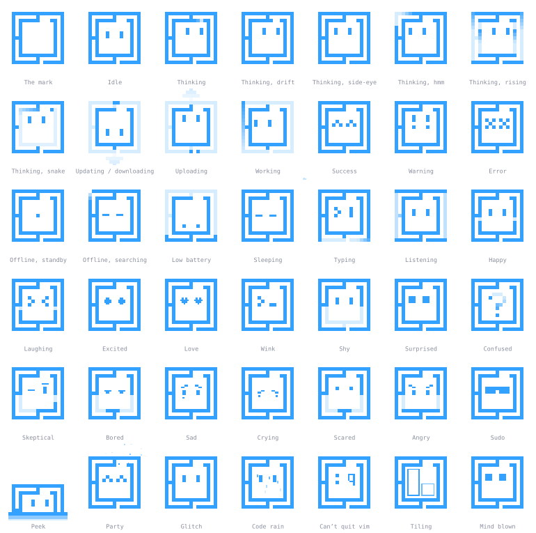

- **state or reaction** is what the mode is for (`kind` in the pack). A
  state stays as long as what it stands for lasts. A reaction is shown for
  its hold after its morph lands, then Omi goes back: `react("success")`
  in Omi.qml, or `omi.hold(mode)` in your own host.
- **loop** is how long the mode takes to play every piece's loop once
  (`loopSeconds`): show a mode at least that long in a tour.
- A **family** groups modes that mean the same thing: pick one per
  situation and treat the rest as variations. **Easter eggs** are jokes;
  leave them out of anything generic.
- **A screen reader says** is the mode's `label` in the pack: the
  accessible name every app gives the picture, so Omi is announced the same
  way everywhere. It is each still's own name on this page.
- "Use it for" is advice for app authors; [docs/omarchy.md](omarchy.md)
  has the rules of thumb behind it (react to what the user did, never
  guilt the user, keep reactions short while they concentrate).

| | id | Name | Kind | Loop | A screen reader says | Use it for |
| --- | --- | --- | --- | --- | --- | --- |
|  | `mark` | The mark | state | still | The Omarchy logo | The plain logo: a brand mark, and the entrance (set idle from it) |
|  | `idle` | Idle | state | 4 s | Omi | Nothing going on |
| 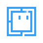 | `thinking` | Thinking | state | 4 s | Omi is thinking | Checking, loading, waiting on the network (family: thinking) |
| 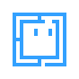 | `thinking-drift` | Thinking, drift | state | 4 s | Omi is thinking | A variation of thinking for a long wait (family: thinking) |
|  | `thinking-sideeye` | Thinking, side-eye | state | 3 s | Omi is thinking | A variation of thinking, with a glance aside (family: thinking) |
|  | `thinking-hmm` | Thinking, hmm | state | 4 s | Omi is thinking | A variation of thinking: weighing something (family: thinking) |
|  | `thinking-stack` | Thinking, rising | state | 4 s | Omi is thinking | A variation of thinking: something building up (family: thinking) |
|  | `thinking-snake` | Thinking, snake | state | 4.7 s | Omi is thinking | A variation of thinking that fits a terminal (an easter egg of sorts) (family: thinking) |
| 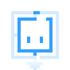 | `updating` | Updating / downloading | state | 4.7 s | Omi is updating | Downloading or installing (family: transfer) |
| 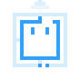 | `uploading` | Uploading | state | 4.7 s | Omi is uploading | Sending something away (family: transfer) |
| 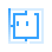 | `working` | Working | state | 3.2 s | Omi is working | Busy doing it for the user |
| 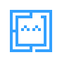 | `success` | Success | reaction, 1.2 s | 1.6 s | Omi succeeded | Done, then back |
|  | `warning` | Warning | state | 2.8 s | Omi has a warning | Something needs a look, but nothing is broken |
|  | `error` | Error | state | 2.2 s | Omi hit an error | Failed: as a reaction, or the mode while it stays failed |
|  | `offline-standby` | Offline, standby | state | 3 s | Omi is offline | Offline and not trying (family: offline) |
|  | `offline-searching` | Offline, searching | state | 7.9 s | Omi is offline, looking for a network | Offline, looking for a network (family: offline) |
| 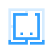 | `low-battery` | Low battery | state | 5 s | Omi is low on battery | The battery is low |
|  | `sleeping` | Sleeping | state | 4.3 s | Omi is asleep | Paused, put off until later, or the night light |
| 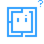 | `asking` | Asking | state | 3 s | Omi has a question | Waiting for the user to decide: an agent wants approval, a dialog needs an answer |
|  | `attention` | Attention | reaction, 1.2 s | 1.2 s | Omi wants your attention | A ping: a notification arrived, a background job finished, then back |
| 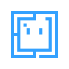 | `recording` | Recording | state | 4 s | Omi is recording the screen | The screen is being shared or recorded, as long as it lasts |
| 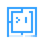 | `typing` | Typing | state | 3.1 s | Omi is typing | The user is typing, or something is being written for them |
|  | `listening` | Listening | state | 1 s | Omi is listening | Waiting for the user to press a key |
|  | `hello` | Hello | reaction, 1.6 s | 1.6 s | Omi says hello | A greeting: first boot, a first open, then back |
|  | `goodbye` | Goodbye | reaction, 1.4 s | 1.4 s | Omi says goodbye | Logout, shutdown, reboot: a tilt and the eyes close, then the host shows the plain logo |
|  | `nod` | Nod | reaction, 0.9 s | 0.7 s | Omi nods: yes | Yes: a small agreement, lighter than success, then back |
|  | `shake` | Shake | reaction, 0.9 s | 0.7 s | Omi shakes its head: no | No: the gentle no that error is too strong for, then back |
|  | `happy` | Happy | reaction, 1.8 s | 4 s | Omi is happy | Pleased, then back |
| 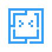 | `laughing` | Laughing | reaction, 1.6 s | 0.7 s | Omi is laughing | A joke landed, then back |
|  | `excited` | Excited | reaction, 1.8 s | 0.9 s | Omi is excited | Something good is about to happen (a theme picker, a download that's nearly done) |
| 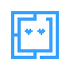 | `love` | Love | reaction, 2 s | 1.2 s | Omi loves it | A favourite, a thank-you, then back |
|  | `wink` | Wink | reaction, 1.2 s | 2.8 s | Omi winks | A small aside, then back |
|  | `shy` | Shy | reaction, 2 s | 6 s | Omi is shy | A compliment received, then back |
|  | `surprised` | Surprised | reaction, 1.4 s | 1.6 s | Omi is surprised | Something unexpected, then back |
|  | `confused` | Confused | state | 3.4 s | Omi is confused | Not sure what happened; a stall |
| 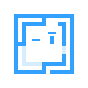 | `skeptical` | Skeptical | state | 5 s | Omi is skeptical | Doubt: an odd input, an unusual request |
| 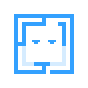 | `bored` | Bored | state | 10 s | Omi is bored | Nothing has happened for a long while |
| 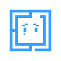 | `sad` | Sad | state | 4 s | Omi is sad | Something was lost; never for a cancel or a skip |
|  | `crying` | Crying | state | 1.2 s | Omi is crying | Something went badly; never to guilt the user |
| 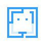 | `scared` | Scared | reaction, 1.6 s | 2.2 s | Omi is scared | A risky action is about to run, then back |
| 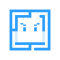 | `angry` | Angry | state | 2 s | Omi is angry | Blocked by something outside the user's control |
|  | `sudo` | Sudo | state | 3.6 s | Omi needs your password | About to ask for a password |
| 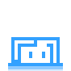 | `peek` | Peek | state | 4.5 s | Omi is peeking in | Looking in from the edge: a hint, a quick check-in |
|  | `party` | Party | state | 3.1 s | Omi is celebrating | A real milestone, like finishing setup |
|  | `glitch` | Glitch | reaction, 1.8 s | 4 s | Omi glitches | An easter egg: something went strange (easter egg) |
| 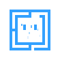 | `code-rain` | Code rain | state | 4 s | Omi is raining code | An easter egg for the terminal (easter egg) |
| 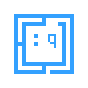 | `vim` | Can’t quit vim | state | 2.2 s | Omi can’t quit vim | An easter egg: can't quit vim (easter egg) |
| 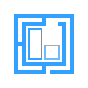 | `tiling` | Tiling | state | 3.7 s | Omi is tiling windows | Windows being arranged (the Omarchy tiling tutorial) |
|  | `mind-blown` | Mind blown | reaction, 2.4 s | 2.4 s | Omi’s mind is blown | Something impressive just happened, then back |
